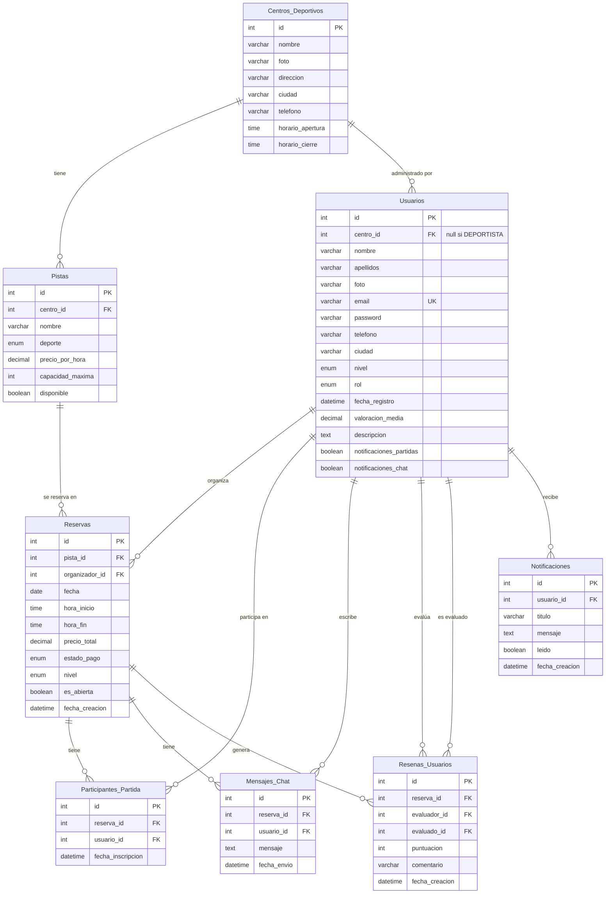

# 🏟️ Reservas Deportivas

Sistema web de reservas de pistas deportivas desarrollado como Trabajo de Fin de Grado (TFG).

Permite a los deportistas reservar pistas, unirse a partidas abiertas, chatear con otros jugadores y valorar a los participantes tras cada partida.

## Stack tecnológico

| Capa | Tecnología |
|---|---|
| Backend | Spring Boot |
| Frontend | Vue |
| Base de datos | H2 |
| Build | Maven |

## Esquema de base de datos

### Enums

| Enum | Valores |
|---|---|
| `RolUsuario` | `DEPORTISTA` · `ADMINISTRADOR_CENTRO` |
| `Deporte` | `PADEL` · `TENIS` · `FUTBOL` · `BALONCESTO` · `SQUASH` · `BADMINTON` |
| `EstadoPago` | `PENDIENTE` · `PAGADO` · `CANCELADO` |
| `Nivel` | `PRINCIPIANTE` · `INTERMEDIO` · `AVANZADO` · `PROFESIONAL` |
